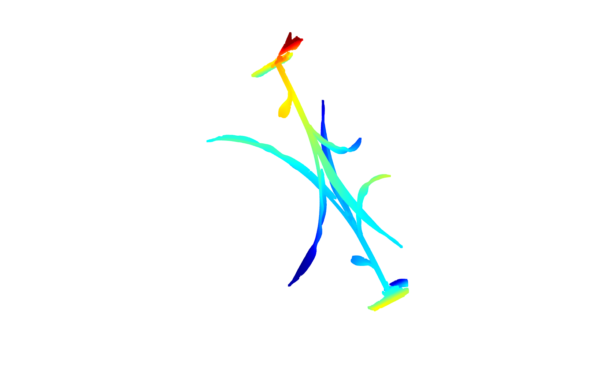

# ICP Registration


ICP registration is the process to align two point clouds `pcd1` and `pcd2`, by calculating rotation and translation

1. **Compute Centroids**
   
2. **Center the Point Clouds**
   
3. **Compute Covariance Matrix** 
   
4. **Perform SVD**
5. **Obtain Rotation Matrix**
   
6. **Compute Translation**
    
7. **Homogenous Transformation Matrix**
 
8. **Apply Transformation**


### Cross verification 

1. Check rotation is correct by checking determinant, R determinant: 1

2. Translation Vector t : The values has to be close to `0`, for perfect alignment
```
Translation Vector t: -1.50067e-11  -2.1771e-11 -3.05818e-11
```
3. Also check for the size of each computation to cross verify in every step.

4. Check  SVD is performed correctly,
misplacing U, V will effect the whole process


## Conclusion

The ICP algorithm aligns two point clouds by computing the rotation and translation.
 
